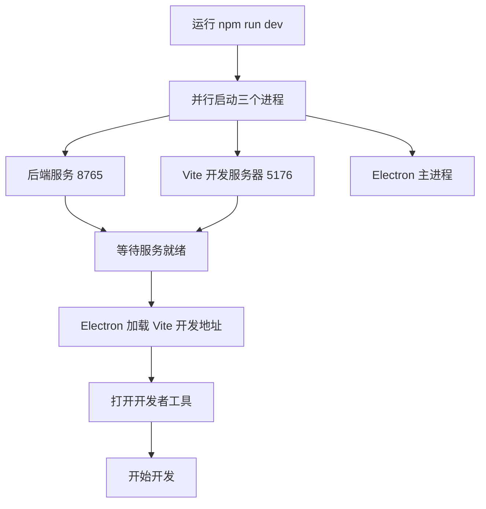
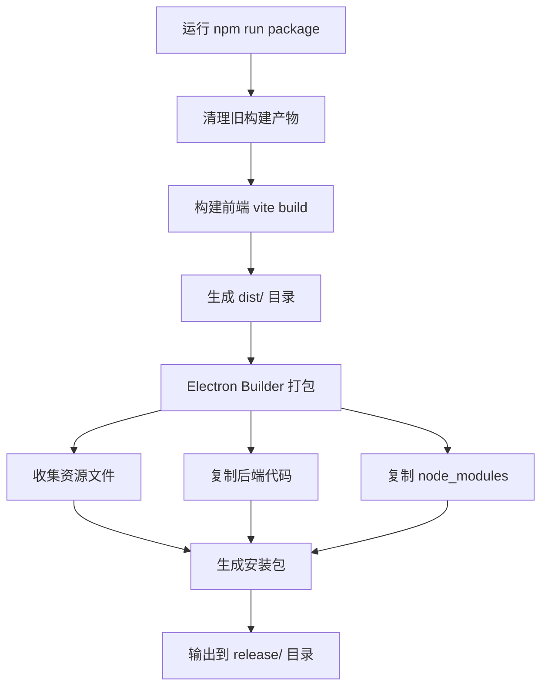
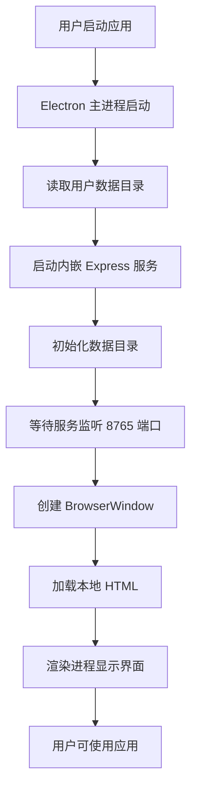

# PenguinMagic Electron 打包设计

## 一、设计目标

将 PenguinMagic 从 Web 应用改造为 Electron 桌面应用，实现以下目标：

- 提供独立的桌面应用程序，无需浏览器即可运行
- 内嵌 Node.js 后端服务，实现前后端一体化打包
- 保持现有功能不变，包括文件管理、图像处理、创意库等
- 支持 Windows、macOS、Linux 跨平台打包
- 提供原生桌面体验，包括菜单栏、托盘图标等

## 二、架构调整

### 2.1 整体架构转换

**当前架构**：
- 前端：Vite + React 独立运行（端口 5176）
- 后端：Node.js Express 服务（端口 8765）
- 通信方式：HTTP 代理转发

**目标架构**：
- Electron 主进程：负责窗口管理、后端服务启动
- Electron 渲染进程：加载前端构建产物
- Node.js 后端：内嵌在 Electron 中运行
- 通信方式：同域直接通信（无需代理）

### 2.2 进程模型

| 进程类型 | 职责 | 技术栈 |
|---------|------|--------|
| 主进程 | 创建窗口、启动后端服务、应用生命周期管理、原生功能调用 | Electron Main API、Node.js |
| 渲染进程 | 加载前端页面、用户交互、业务逻辑 | React、Vite 构建产物 |
| 后端服务 | API 服务、文件处理、数据存储 | Express、Sharp |

### 2.3 关键调整点

**路径解析**：
- 开发环境：使用相对路径定位资源
- 打包环境：使用 `app.getAppPath()` 定位打包后的资源路径
- 用户数据：使用 `app.getPath('userData')` 存储配置和数据文件

**后端服务启动**：
- 主进程启动时自动启动后端 Express 服务
- 监听本地端口（默认 8765）
- 窗口加载本地服务地址

**构建流程**：
- 先构建前端（Vite build）
- 将前端产物放入后端静态资源目录
- 打包 Electron 应用（包含前端和后端）

## 三、实施方案

### 3.1 依赖调整

**新增 Electron 依赖**：
- electron：桌面应用框架
- electron-builder：打包工具
- concurrently：并行启动开发服务

**保留现有依赖**：
- 前端：React、@xyflow/react、@google/genai 等
- 后端：Express、Sharp、CORS 等

### 3.2 目录结构调整

```
PenguinMagic/
├── electron/                    # Electron 主进程代码
│   ├── main.js                 # 主进程入口
│   ├── preload.js              # 预加载脚本
│   └── icon.png                # 应用图标
├── backend-nodejs/             # 后端服务（保持不变）
├── components/                 # 前端组件（保持不变）
├── dist/                       # 前端构建产物
├── resources/                  # 打包资源（图标、安装配置）
└── package.json                # 更新脚本和依赖
```

### 3.3 主进程设计

**主进程核心职责**：

1. **窗口创建与管理**
   - 创建主窗口，默认尺寸 1280x800
   - 配置窗口属性：标题、图标、最小尺寸
   - 开发环境打开 DevTools

2. **后端服务启动**
   - 在 app.ready 事件中启动 Express 服务
   - 等待服务就绪后加载窗口
   - 监听服务端口是否可用

3. **生命周期管理**
   - 监听窗口关闭事件
   - 退出前停止后端服务
   - macOS 支持窗口关闭后继续运行

4. **IPC 通信**
   - 暴露必要的原生 API 给渲染进程
   - 提供文件选择、对话框等原生功能

**主进程配置参数**：

| 参数 | 说明 | 默认值 |
|------|------|--------|
| windowWidth | 窗口宽度 | 1280 |
| windowHeight | 窗口高度 | 800 |
| minWidth | 最小宽度 | 1024 |
| minHeight | 最小高度 | 768 |
| backendPort | 后端端口 | 8765 |
| backendHost | 后端地址 | 127.0.0.1 |

### 3.4 渲染进程调整

**Vite 配置修改**：
- 构建目标设置为 Electron 渲染进程
- 移除开发环境代理配置（同域通信）
- 调整 base 路径为相对路径

**环境变量处理**：
- API Key 通过 Electron 主进程注入
- 避免在渲染进程直接访问 Node.js 环境变量

**API 请求调整**：
- 开发环境：请求 Vite 开发服务器（通过代理）
- 生产环境：请求 Electron 内嵌的后端服务

### 3.5 后端服务调整

**配置路径调整**：
- 基础目录：Electron 打包环境下使用 `app.getPath('userData')`
- 前端资源目录：使用 `app.getAppPath()` + '/dist'
- 数据目录：用户数据目录 + '/data'
- 文件目录：用户数据目录 + '/input'、'/output' 等

**服务启动方式**：
- 开发环境：独立启动（npm run dev）
- 生产环境：由 Electron 主进程启动

**静态资源服务**：
- 保持现有静态文件托管不变
- 确保路径解析正确

### 3.6 构建脚本设计

**开发模式**：
- 启动后端服务（端口 8765）
- 启动 Vite 开发服务器（端口 5176）
- 启动 Electron 主进程（加载 Vite 服务）

**生产构建**：
1. 构建前端：`vite build` → 生成 dist/
2. 打包 Electron：`electron-builder` → 生成可执行文件
3. 后端代码随 Electron 一起打包

**脚本配置**：

| 脚本名称 | 命令 | 说明 |
|---------|------|------|
| dev | electron-dev | 开发模式启动 |
| build | vite build | 构建前端 |
| electron:build | electron-builder | 打包 Electron 应用 |
| package | build + electron:build | 完整打包流程 |

### 3.7 打包配置设计

**Electron Builder 配置**：

**通用配置**：
- appId：com.penguin.magic
- 产品名称：PenguinMagic
- 版本号：与 package.json 保持一致
- 包含资源：dist/、backend-nodejs/、data/

**Windows 配置**：
- 目标格式：NSIS 安装包、便携版
- 图标：resources/icon.ico
- 安装选项：创建桌面快捷方式、开始菜单

**macOS 配置**：
- 目标格式：DMG、ZIP
- 图标：resources/icon.icns
- 代码签名：开发阶段跳过

**Linux 配置**：
- 目标格式：AppImage、DEB
- 图标：resources/icon.png
- 分类：Graphics、Utility

**打包资源清单**：

| 资源类型 | 路径 | 说明 |
|---------|------|------|
| 前端资源 | dist/ | Vite 构建产物 |
| 后端代码 | backend-nodejs/src/ | Express 服务代码 |
| 后端依赖 | backend-nodejs/node_modules/ | 运行时依赖 |
| 应用图标 | resources/icon.* | 不同平台图标 |
| 配置文件 | package.json | 应用元信息 |

## 四、兼容性设计

### 4.1 现有功能保持不变

所有现有功能在 Electron 环境下保持完全一致：
- 桌面交互系统
- 创意库管理
- 图像生成与处理
- 历史记录
- 设置管理

### 4.2 路径兼容处理

**文件路径统一处理**：
- 开发环境：使用项目根目录
- 打包环境：使用用户数据目录
- 通过配置模块统一管理

**API 路径保持不变**：
- 前端 API 请求路径无需修改
- 后端路由保持现有定义

### 4.3 环境变量处理

**API Key 管理**：
- 开发环境：从 .env 文件读取
- 生产环境：通过设置界面配置，存储到 userData

**环境标识**：
- 通过 `process.env.NODE_ENV` 区分开发/生产
- Electron 主进程设置环境变量

## 五、开发流程

### 5.1 开发环境启动流程



### 5.2 生产构建流程



### 5.3 应用启动流程



## 六、注意事项

### 6.1 安全性

- 启用上下文隔离（contextIsolation）
- 禁用 Node.js 集成在渲染进程（nodeIntegration: false）
- 通过 preload 脚本安全暴露必要的 API
- 验证所有 IPC 消息来源

### 6.2 性能

- 懒加载大型依赖（如 Sharp）
- 后端服务使用单独进程，避免阻塞主进程
- 合理设置窗口加载超时
- 优化打包体积，排除开发依赖

### 6.3 用户体验

- 首次启动显示欢迎界面
- 提供原生菜单栏（文件、编辑、视图、帮助）
- 支持托盘图标和最小化到托盘
- 应用更新检查机制（可选）

### 6.4 跨平台

- 路径分隔符使用 `path.join()`，避免硬编码
- 文件权限在 Linux/macOS 下需要特殊处理
- 图标准备多种格式（.ico、.icns、.png）
- 测试不同平台下的打包和运行

### 6.5 调试

- 开发环境自动打开 DevTools
- 主进程和渲染进程分别配置日志
- 使用 Electron DevTools Extension
- 保留后端服务日志输出

## 七、文件清单

### 7.1 新增文件

| 文件路径 | 说明 |
|---------|------|
| electron/main.js | Electron 主进程入口 |
| electron/preload.js | 预加载脚本，安全桥接 |
| resources/icon.ico | Windows 图标 |
| resources/icon.icns | macOS 图标 |
| resources/icon.png | Linux 图标及通用图标 |
| electron-builder.json | Electron Builder 配置文件 |

### 7.2 修改文件

| 文件路径 | 修改内容 |
|---------|---------|
| package.json | 添加 Electron 依赖、更新脚本、配置 main 字段 |
| vite.config.ts | 调整 base 路径、构建目标 |
| backend-nodejs/src/config.js | 添加 Electron 环境路径处理 |
| backend-nodejs/src/server.js | 支持作为模块导出，供主进程调用 |

## 八、后续优化

### 8.1 功能增强

- 自动更新功能（electron-updater）
- 崩溃报告收集
- 原生菜单栏和右键菜单
- 拖拽文件到应用窗口
- 全局快捷键支持

### 8.2 性能优化

- 窗口预加载优化
- 后端服务懒启动
- 资源按需加载
- 打包体积优化

### 8.3 用户体验

- 启动画面（splash screen）
- 多语言支持
- 暗色/亮色主题跟随系统
- 托盘菜单快捷操作

## 九、风险与应对

| 风险 | 影响 | 应对措施 |
|------|------|---------|
| Sharp 二进制依赖打包失败 | 图像处理功能不可用 | 使用 electron-builder 的 extraResources 配置，确保正确打包 native 模块 |
| 打包体积过大 | 下载和安装时间长 | 排除不必要的依赖，使用 asar 压缩，分平台打包 |
| 路径解析错误 | 无法读取文件和资源 | 严格使用 Electron 提供的路径 API，避免硬编码 |
| 端口冲突 | 后端服务启动失败 | 检测端口占用，自动切换可用端口 |
| 跨平台兼容问题 | 部分平台无法运行 | 在各平台进行充分测试，使用 CI 自动化构建 |
